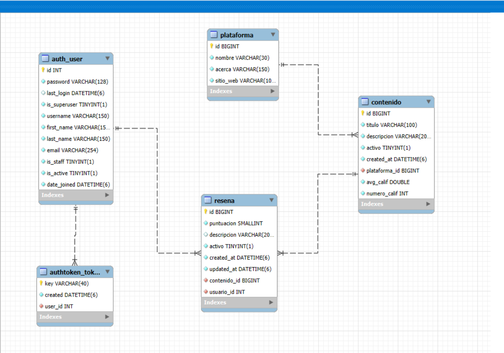

# Proyecto Django con DRF

Este proyecto es una API construida con **Django** y **Django REST Framework**.

## 🚀 Instalación

1. Clonar el repositorio:
   ```bash
   git clone https://github.com/olmos-dev/proyecto-drf.git
   
   cd mi_proyecto_drf
## Descripcion 
* El usuario administrador con staff activo es quien puede activar o desactivar las reseñas para que sean mostradas o no según del caso
* El administrador es quien solo agrega la plataforma y el contenido
* Cada usuario solo puede escribir una reseña por contenido, él es el único que puede modificar su reseña

## Modelo relacional 


